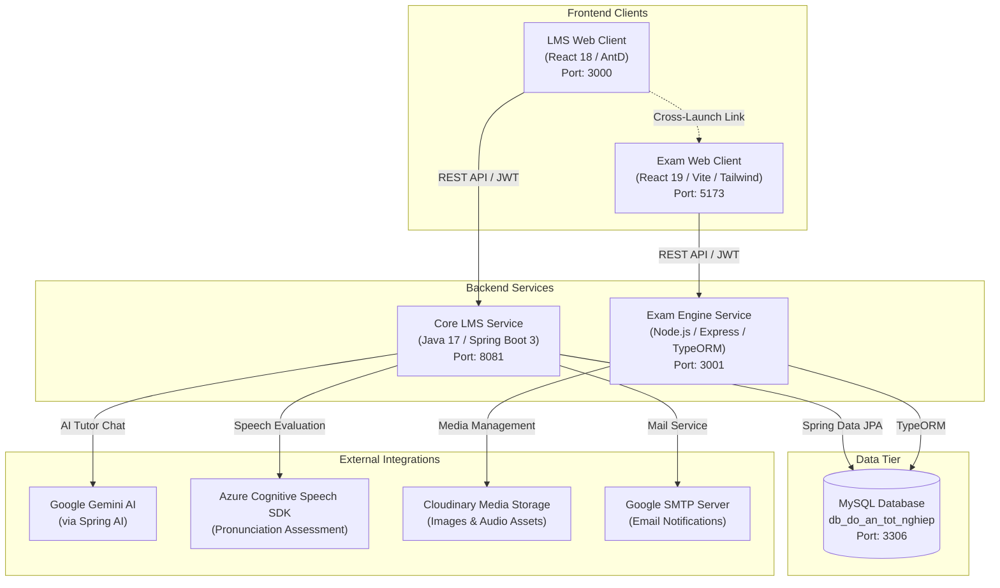

# English Certification Learning & Exam Preparation System
### *Hệ Thống Học và Luyện Thi Chứng Chỉ Tiếng Anh (Đồ Án Tốt Nghiệp)*

[](https://spring.io/projects/spring-boot)
[](https://openjdk.org/)
[](https://nodejs.org/)
[](https://www.typescriptlang.org/)
[](https://react.dev/)
[](https://vitejs.dev/)
[](https://www.mysql.com/)
[](https://tailwindcss.com/)
[](https://ant.design/)

---

## 📖 Table of Contents

- [Overview](#-overview)
- [System Architecture](#-system-architecture)
- [Project Directory Structure](#-project-directory-structure)
- [Components & Tech Stack](#-components--tech-stack)
- [Prerequisites](#-prerequisites)
- [Quick Start Guide](#-quick-start-guide)
  - [1. Database Setup](#1-database-setup)
  - [2. Core Backend Service (Spring Boot)](#2-core-backend-service-spring-boot)
  - [3. Exam Backend Service (Node.js/TypeScript)](#3-exam-backend-service-nodejstypescript)
  - [4. LMS Web Portal (React CRA)](#4-lms-web-portal-react-cra)
  - [5. Exam Web Portal (React Vite)](#5-exam-web-portal-react-vite)
- [Service & Port Reference](#-service--port-reference)
- [Environment Configuration](#-environment-configuration)
- [Key Features](#-key-features)
- [Troubleshooting & FAQs](#-troubleshooting--faqs)
- [Authors & License](#-authors--license)

---

## 🌟 Overview

The **English Certification Learning & Exam Preparation System** is a modular, enterprise-grade web platform designed to assist students and professionals in studying courses and preparing for standardized English proficiency tests (specifically **TOEIC**).

The system adopts a **Tiered Polyglot Architecture**:
- **Core LMS Service**: Handles core business logic, user authentication, role management, course catalogs, syllabus modules, video lessons, AI tutoring via Google Gemini, speech/pronunciation assessment via Microsoft Azure, and personalized study roadmaps.
- **Dedicated Exam Engine**: High-performance microservice specialized for TOEIC exam simulation, audio streaming, question banks, timed test sessions, auto-grading, and comprehensive review solutions.
- **Two Tailored Web Clients**:
  - A comprehensive **Learning Management System (LMS) Web Portal** for course navigation, lessons, dashboards, and study plans.
  - A specialized **TOEIC Examination Web Portal** simulating real-world test environments with timers, audio controls, and interactive answer sheets.

---

## 🏗 System Architecture



---

## 📁 Project Directory Structure

```
.
├── backend/
│   ├── core-service/              # Java 17 / Spring Boot 3 Core Backend (Port 8081)
│   │   ├── src/
│   │   │   ├── main/java/com/mxhieu/doantotnghiep/
│   │   │   │   ├── controller/   # REST Controllers (Auth, Course, AI, Speech, StudyPlan...)
│   │   │   │   ├── service/      # Business logic layer
│   │   │   │   ├── repository/   # Spring Data JPA repositories
│   │   │   │   ├── entity/       # JPA Entities mapped to MySQL
│   │   │   │   └── config/       # Security, Spring AI, CORS, and Speech configs
│   │   │   └── main/resources/   # application.properties, application.yml, templates
│   │   ├── mvnw / mvnw.cmd        # Maven wrappers
│   │   └── pom.xml                # Project Object Model & Maven dependencies
│   │
│   └── exam-service/              # Node.js / Express / TypeScript Exam Engine (Port 3001)
│       ├── src/
│       │   ├── presentation/      # Express controllers, routes, and middlewares
│       │   ├── domain/            # Domain entities, types, and interfaces
│       │   ├── infrastructure/    # Database connection, TypeORM migrations, Cloudinary
│       │   └── server.ts          # Server bootstrap & lifecycle management
│       ├── .env.example           # Exam service environment template
│       ├── tsconfig.json          # TypeScript compiler configuration
│       └── package.json           # npm dependencies and scripts
│
├── frontend/
│   ├── lms-web/                   # React 18 LMS Portal (Port 3000)
│   │   ├── public/                # Static assets and icons
│   │   ├── src/
│   │   │   ├── pages/             # Course, Home, Student, Teacher, Admin dashboards
│   │   │   ├── components/        # Reusable UI components, headers, sidebars
│   │   │   ├── services/          # Axios/fetch API client integration
│   │   │   └── utils/             # Request interceptors, token helpers
│   │   └── package.json           # React CRA dependencies
│   │
│   └── exam-web/                  # React 19 / Vite TOEIC Exam Portal (Port 5173)
│       ├── public/                # Audio files, static exam images, assets
│       ├── src/
│       │   ├── pages/             # Exam test runner, answer review, admin test builder
│       │   ├── components/        # Audio players, question cards, timers
│       │   ├── services/          # Exam API communication clients
│       │   └── hooks/             # Custom test attempt and timer hooks
│       ├── tailwind.config.js     # Tailwind CSS styles & design tokens
│       ├── vite.config.js         # Vite bundler configuration
│       └── package.json           # Vite & React dependencies
│
├── database/
│   └── database_merge.sql         # Consolidated MySQL DDL schema & initial seed data
│
└── README.md                      # Comprehensive project documentation
```

---

## 💻 Components & Tech Stack

### 1. Core Backend (`backend/core-service`)
- **Runtime & Framework**: Java 17, Spring Boot 3.5.6
- **Data Access**: Spring Data JPA, Hibernate, MySQL Connector/J
- **Security**: Spring Security, OAuth2 Resource Server, JWT Authentication, BCrypt
- **Artificial Intelligence**: Spring AI (Model OpenAI adapter configured with Google Gemini 2.0 Flash)
- **Speech Processing**: Microsoft Cognitive Services Speech SDK (pronunciation assessment & audio synthesis)
- **Email & Templates**: Spring Boot Starter Mail, Thymeleaf template engine
- **Utility**: Lombok, ModelMapper, Google Guava, Apache Commons IO

### 2. Exam Engine Service (`backend/exam-service`)
- **Runtime & Language**: Node.js 18+, TypeScript 5.2, Express 4.18
- **ORM & Database**: TypeORM 0.3, MySQL2
- **Validation & Serialization**: `class-validator`, `class-transformer`
- **File Upload & Cloud Storage**: Multer, Cloudinary SDK
- **Security & Utilities**: JWT verification, CORS, `express-rate-limit`, Winston logger, Swagger UI

### 3. LMS Web Portal (`frontend/lms-web`)
- **Framework**: React 18, React Router DOM v7
- **UI & Styling**: Ant Design (AntD v5), Sass/SCSS
- **Media & Visualization**: Shaka Player, Video-React, Recharts
- **Tooling**: Create React App (react-scripts)

### 4. Exam Web Portal (`frontend/exam-web`)
- **Framework**: React 19, React Router DOM v7
- **Tooling & Build**: Vite 7
- **Styling & UI**: Tailwind CSS 3.4, Lucide React, React Icons, Framer Motion
- **State & Communication**: Axios, React Toastify

---

## ⚙️ Prerequisites

Ensure the following runtimes and tools are installed on your host machine:

- **Java Development Kit (JDK)**: Version 17 or higher
- **Node.js**: Version 18.x or 20.x LTS (with `npm` v9+)
- **MySQL Server**: Version 8.0 or higher
- **Git**: For version control

---

## 🚀 Quick Start Guide

### 1. Database Setup

1. Start your local MySQL server instance (default port: `3306`).
2. Create the target database:
   ```sql
   CREATE DATABASE db_do_an_tot_nghiep CHARACTER SET utf8mb4 COLLATE utf8mb4_unicode_ci;
   ```
3. Import the consolidated schema and seed records:
   - **Using Command Line (Windows PowerShell)**:
     ```powershell
     Get-Content database\database_merge.sql | mysql -u root -p db_do_an_tot_nghiep
     ```
   - **Using MySQL CLI (Linux / macOS)**:
     ```bash
     mysql -u root -p db_do_an_tot_nghiep < database/database_merge.sql
     ```
   - *Or import `database/database_merge.sql` directly via MySQL Workbench / DBeaver / Navicat.*

---

### 2. Core Backend Service (Spring Boot)

1. Navigate to the core service directory:
   ```bash
   cd backend/core-service
   ```
2. Verify configuration in `src/main/resources/application-uat.properties` (or `application.properties`):
   ```properties
   spring.datasource.url=jdbc:mysql://localhost:3306/db_do_an_tot_nghiep
   spring.datasource.username=root
   spring.datasource.password=your_mysql_password
   ```
3. Run the application using the Maven wrapper:
   - **Windows**:
     ```cmd
     mvnw.cmd spring-boot:run
     ```
   - **Linux / macOS**:
     ```bash
     ./mvnw spring-boot:run
     ```
4. The service will boot on **`http://localhost:8081`**.

---

### 3. Exam Backend Service (Node.js/TypeScript)

1. Navigate to the exam service directory:
   ```bash
   cd backend/exam-service
   ```
2. Install npm dependencies:
   ```bash
   npm install
   ```
3. Create the environment file:
   - Copy `.env.example` to `.env`:
     ```bash
     cp .env.example .env
     ```
   - Update your MySQL credentials (`DB_USERNAME`, `DB_PASSWORD`, `DB_DATABASE=db_do_an_tot_nghiep`).
4. Start the development server with live reload:
   ```bash
   npm run dev
   ```
5. The exam API will start on **`http://localhost:3001/api/exam`**.
   - Health check: `http://localhost:3001/health`

---

### 4. LMS Web Portal (React CRA)

1. Navigate to the LMS frontend directory:
   ```bash
   cd frontend/lms-web
   ```
2. Install npm dependencies:
   ```bash
   npm install --legacy-peer-deps
   ```
3. Start the React development server:
   ```bash
   npm start
   ```
4. The application opens automatically at **`http://localhost:3000`**.

---

### 5. Exam Web Portal (React Vite)

1. Navigate to the exam frontend directory:
   ```bash
   cd frontend/exam-web
   ```
2. Install npm dependencies:
   ```bash
   npm install
   ```
3. Ensure `.env` is configured:
   ```env
   VITE_API_URL=http://localhost:3001/api/exam
   ```
4. Start the Vite development server:
   ```bash
   npm run dev
   ```
5. Access the examination client at **`http://localhost:5173`**.

---

## 📡 Service & Port Reference

| Component | Technology | Default Port | Base URL / Entry | Health Check / Status |
| :--- | :--- | :--- | :--- | :--- |
| **MySQL Database** | Relational DB | `3306` | `localhost:3306/db_do_an_tot_nghiep` | Database CLI / Admin tool |
| **Core LMS Backend** | Spring Boot 3 | `8081` | `http://localhost:8081` | `http://localhost:8081/` |
| **TOEIC Exam Backend** | Express / TS | `3001` | `http://localhost:3001/api/exam` | `http://localhost:3001/health` |
| **LMS Web Client** | React 18 (CRA)| `3000` | `http://localhost:3000` | Browser application |
| **Exam Web Client** | React 19 (Vite)| `5173` | `http://localhost:5173` | Browser application |

---

## 🔐 Environment Configuration

### Backend Core Service (`backend/core-service`)
Managed in `src/main/resources/application.properties` and `src/main/resources/application.yml`:

| Parameter | Default / Format | Description |
| :--- | :--- | :--- |
| `server.port` | `8081` | HTTP listening port |
| `spring.datasource.url` | `jdbc:mysql://localhost:3306/db_do_an_tot_nghiep` | Database connection string |
| `spring.datasource.username` | `root` | Database username |
| `spring.datasource.password` | `123456` | Database password |
| `jwt.signer-key` | `${JWT_SIGNER_KEY}` | Secret key for JWT signing & verification |
| `spring.ai.openai.api-key` | Gemini API Key | Google Gemini API key for Spring AI tutor |
| `azure.speech.key` | `${AZURE_SPEECH_KEY}` | Microsoft Azure Speech service API key |
| `azure.speech.region` | `${AZURE_SPEECH_REGION}` | Azure Cognitive Services region |
| `merriam.api-key` | API Key | Merriam-Webster Dictionary API key |

### Backend Exam Service (`backend/exam-service`)
Configured in `.env`:

| Parameter | Default | Description |
| :--- | :--- | :--- |
| `PORT` | `3001` | HTTP listening port |
| `API_PREFIX` | `/api/exam` | Global routing prefix |
| `DB_HOST` | `localhost` | MySQL Host |
| `DB_PORT` | `3306` | MySQL Port |
| `DB_USERNAME` | `root` | MySQL Username |
| `DB_PASSWORD` | `your_password` | MySQL Password |
| `DB_DATABASE` | `db_do_an_tot_nghiep` | Target database name |
| `JWT_SECRET` | Secret String | Shared JWT secret key (must align with Spring Boot) |
| `CLOUDINARY_*` | Cloud credentials | Cloudinary API Key, Secret & Cloud Name |
| `CORS_ORIGIN` | `http://localhost:3000` | Permitted origin for CORS |

### Frontend Exam Web (`frontend/exam-web`)
Configured in `.env`:

| Parameter | Value | Description |
| :--- | :--- | :--- |
| `VITE_API_URL` | `http://localhost:3001/api/exam` | URL endpoint for the Exam backend |

---

## 🎯 Key Features

### 🎓 1. Learning Management System (LMS)
- **Course & Lesson Delivery**: Structured modules with rich text, resources, and video lectures (supporting HLS/DASH streaming via Shaka Player and Video-React).
- **Study Roadmaps & Daily Planner**: Personalized schedule generator tracking student progress through syllabus milestones.
- **Student & Teacher Portals**: Dedicated interfaces for assignment tracking, course enrollment, class statistics, and teacher course management.
- **Built-in Vocabulary Dictionary**: Look up words, phonetics, definitions, and examples stored in personal student dictionaries.

### 🤖 2. AI Tutor & Speech Assessment
- **AI Chatbot Tutor**: Powered by Spring AI integrated with Google Gemini 2.0 Flash to explain grammar rules, analyze sentence structure, and provide personalized learning tips.
- **Pronunciation Assessment**: Real-time voice recording evaluation using Microsoft Azure Speech SDK to score pronunciation accuracy, fluency, and completeness.

### 📝 3. TOEIC Exam Simulation Engine
- **Full-scale TOEIC Tests**: Complete coverage of standard Listening (Parts 1–4) and Reading (Parts 5–7) test sections.
- **Real-time Exam Environment**: Countdown timers, audio play controls, interactive numbered answer sheet navigation, and instant test submission.
- **Instant Grading & Review**: Automated score breakdown (scaled to 990 points), detailed solution explanations, and performance metrics.
- **Admin Test Authoring**: Full management interface to create exams, organize question banks, and upload audio recordings and illustration images.

---

## 🛠 Troubleshooting & FAQs

#### 1. CORS Errors between Web Apps and APIs
- Make sure `CORS_ORIGIN` in `backend/exam-service/.env` permits `http://localhost:3000` and `http://localhost:5173`.
- In `backend/core-service`, verify the WebMvcConfigurer / SecurityFilterChain CORS configuration allows cross-origin requests from both frontend ports.

#### 2. Database Table Naming & Case Sensitivity
- MySQL on Windows is case-insensitive by default, while Linux can be case-sensitive. The database script uses standard naming conventions; if deploying to Linux, configure `lower_case_table_names=1` in `my.cnf` if table resolution issues arise.

#### 3. Speech Assessment / Azure Key Missing
- If you do not have active Azure Cognitive Speech keys, the core application will boot normally; only the pronunciation scoring endpoints in `TextToSpeechController` will return an error until valid credentials are provided.

#### 4. Shared Authentication between Spring Boot and Node.js
- Both `backend/core-service` and `backend/exam-service` use JWTs. Ensure `jwt.signer-key` in Spring Boot and `JWT_SECRET` in Node.js are synchronized to permit seamless cross-service token authentication.

---
